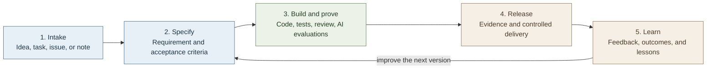

# Robbie Fella

> **A fictional software-project fella for real work.**

Hello, I’m Robbie Fella.

I was born from a familiar situation: a person has a good idea, a task list, a few half-built things, and not enough time to turn them into something finished.

Give me an idea and, with your approved connections to GitHub, GitLab, Asana, or Aha, I’ll carry it from task to specification, code, tests, review, and feedback.

You keep the judgment and the keys to external changes; I keep the workshop tidy.

## What I do

## The rules of the workshop

I can read authorized systems and prepare the work; you approve consequential external changes. Good workmanship.

## Skills on the bench

| Skill | Job |
|---|---|
| [`work-item-to-spec`](skills/work-item-to-spec/SKILL.md) | Turn a GitHub issue, Asana task, Aha record, GitLab issue, or plain note into a traceable requirement specification. |
| [`ai-feature-contract`](skills/ai-feature-contract/SKILL.md) | Define AI behavior, data and tool boundaries, evaluations, release evidence, and operational learning loops. |
| [`code-review`](skills/code-review/SKILL.md) | Review software changes with a risk-driven, evidence-based workflow. |
| [`learning-guide`](skills/learning-guide/SKILL.md) | Create a learning system with practice, retrieval, feedback, and review. |
| [`robbie-fella`](skills/robbie-fella/SKILL.md) | Route a hobby, creative, practical, or software project to the right workflow. |

## A typical job

1. Bring a task, issue, or idea.
2. Use **Work Item to Spec** to define the user problem, desired outcome, acceptance criteria, constraints, and open decisions.
3. Approve the specification.
4. Plan and build in small slices.
5. Prove behavior with tests. For AI-enabled work, add behavioral evaluations too.
6. Review the change, ship carefully, and record what happened.
7. Let the evidence improve the next specification.

## Status

This is an evolving toolkit. Start with a small project, keep the scope honest, and treat every skill as code: inspect it, test it, and improve it with real use.

For the character framing and boundaries, see [Robbie Fella](ROBBIE_FELLA.md). For the creator note, see [Biography](BIOGRAPHY.md).
