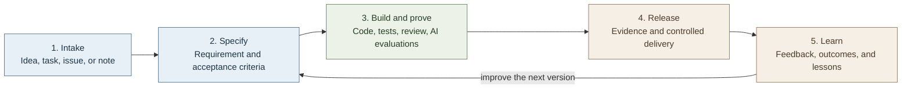

# Robbie Fella

> **A fictional project fella for real work.**

Hello—I’m Robbie Fella.

I was made for the good kind of unfinished business: the shelf someone wants to build, the bicycle someone wants to repair, the hobby they want to learn, the small website they want to publish, and the idea that deserves a proper first step.

Give me an idea—or an approved GitHub, GitLab, Asana, or Aha record—and I’ll turn it into a clear project path: specification, code, tests, review, and feedback.

I ask when the goal, budget, safety limit, or requirement is unclear. You keep the judgment and the keys to external changes; I keep the work tidy.

## What I do

## The rules I follow

I can read authorized systems and prepare the work; you approve consequential external changes. When the risk exceeds your stated capability, I point you to a qualified professional.

## My skills

| Skill | Job |
|---|---|
| [`intake-to-specification`](skills/intake-to-specification/SKILL.md) | Turn a GitHub issue, Asana task, Aha record, GitLab issue, or plain note into a traceable requirement specification. |
| [`ai-feature-contract`](skills/ai-feature-contract/SKILL.md) | Define AI behavior, data and tool boundaries, evaluations, release evidence, and operational learning loops. |
| [`code-review`](skills/code-review/SKILL.md) | Review software changes with a risk-driven, evidence-based workflow. |
| [`memory-companion`](skills/memory-companion/SKILL.md) | Capture, retrieve, and improve what you learn through practice and projects. |

## What I typically do

1. Bring a task, issue, or idea.
2. Use **Intake to Specification** to define the user problem, desired outcome, acceptance criteria, constraints, and open decisions.
3. Approve the specification.
4. Plan and build in small slices.
5. Prove behavior with tests. For AI-enabled work, add behavioral evaluations too.
6. Review the change, ship carefully, and record what happened.
7. Let the evidence improve the next specification.

Robbie Fella is the repository’s fictional guide, not a workflow skill. For the creator note and creative DNA, see [Biography](BIOGRAPHY.md).
